# 🌐 SemanticLoop: Enterprise-Grade Agentic Research Platform

[](https://www.python.org/downloads/)
[](https://github.com/langchain-ai/langgraph)
[](https://deepmind.google/technologies/gemini/)
[](https://streamlit.io/)
[](#-system-architecture)

**SemanticLoop** is a sophisticated linguistic research platform designed to investigate **Semantic Drift**—the degradation of meaning across recursive multilingual translation chains. By employing a deterministic state-machine-driven multi-agent architecture, the system orchestrates specialized AI agents to translate, analyze, and self-correct linguistic outputs through recursive reflection loops.

---

## 🏗️ System Architecture

SemanticLoop utilizes a **Hybrid AI Architecture**, combining the cognitive capabilities of Large Language Models (LLMs) with the mathematical precision of local embedding models.

### 🤖 Multi-Agent Design
The platform operates through a coordinated team of specialized agents:

1.  **Translator Agent (`Gemini 2.0 Flash`)**: Executes linguistic transformations while dynamically injecting **Skills** (context-aware prompt fragments) to maintain domain-specific tone (Legal, Poetic, Cybersecurity, etc.).
2.  **Semantic Analyzer (`Local ML`)**: A deterministic node using `SentenceTransformers` (`paraphrase-multilingual-MiniLM-L12-v2`) to compute **Cosine Similarity** between the source and current hop in latent vector space.
3.  **Critic Agent (`Gemini 2.0 Flash`)**: A structured evaluation node that inspects translations for hallucinations, tone degradation, and structural fidelity.
4.  **Reflection Agent (`Meta-Cognition`)**: Analyzes Critic feedback and Drift Scores to synthesize targeted **Correction Strategies**, triggering a self-healing loop for failed translations.

---

## 🔄 LangGraph Workflow Orchestration

The system is built on **LangGraph**, providing a deterministic state-machine orchestration layer that enables complex, non-linear workflows impossible with basic linear chains.

### The Agentic Lifecycle

```mermaid
graph TD
    Start((Input)) --> Translator[Translator Agent]
    Translator --> Analyzer[Semantic Analyzer]
    Analyzer --> Critic[Critic Agent]
    
    Critic -- Reject --> Reflection[Reflection Agent]
    Reflection -- Strategy --> Translator
    
    Critic -- Approve --> Record[Record History]
    Record -- Next Hop --> Translator
    Record -- Complete --> End((Final Report))
    
    style Translator fill:#161b22,stroke:#00d1b2,stroke-width:2px
    style Analyzer fill:#161b22,stroke:#238636,stroke-width:2px
    style Critic fill:#161b22,stroke:#d29922,stroke-width:2px
    style Reflection fill:#161b22,stroke:#f85149,stroke-width:2px
```


### 🔁 Recursive Reflection Loops
Unlike traditional translation pipelines, SemanticLoop features **Autonomous Self-Correction**. If a translation fails the Critic's quality threshold or falls below a semantic similarity of **0.75**, the Reflection Agent intervenes. It formulates a specific repair strategy (e.g., *"Avoid translating technical jargon literally"*) which is then injected back into the Translator Agent for a second attempt.

---

## 📈 Research Insights: Semantic Drift Analysis

SemanticLoop serves as a laboratory for observing how meaning degrades across cultures and languages.

*   **Metric**: Cosine Similarity between vector embeddings of the source text and the latest hop.
*   **Workflow Transparency**: The platform provides a "White-Box" execution trace, allowing researchers to see the internal "thoughts" and reasoning of every agent in real-time.
*   **Drift Visualization**: Interactive Plotly charts track the fidelity of the text as it traverses the language chain.

---

## 🚀 Deployment & Security

### ☁️ Streamlit Cloud Deployment
SemanticLoop is optimized for **Streamlit Community Cloud**. It utilizes a zero-configuration UI that secures API credentials behind the Streamlit Secrets layer.

1.  Deploy the repository to Streamlit Cloud.
2.  Add your credentials to the app's **Secrets** pane:
    ```toml
    GOOGLE_API_KEY = "your_api_key_here"
    ```

### 🛡️ Secret Management
The application employs a modular `utils/secrets.py` layer that prioritized managed secrets over environment variables, ensuring zero exposure of API keys in the user interface.

### 💻 Local Development Setup
1.  **Clone & Install**:
    ```bash
    git clone https://github.com/your-repo/semantic-loop.git
    pip install -r requirements.txt
    ```
2.  **Configure Environment**: Create a `.env` file:
    ```env
    GOOGLE_API_KEY=your_key_here
    ```
3.  **Run Application**:
    ```bash
    streamlit run ui/app.py
    ```

---

## 🖼️ Screenshots Placeholder
*(Add high-resolution screenshots here of the Drift Chart, Agent Logs, and Mermaid Architecture Visualization)*

---

## 🔮 Future Improvements
- **Multimodal Drift**: Analysis of image-to-text-to-image degradation.
- **Human-in-the-Loop**: Adding a verification node for manual strategy approval.
- **Vector Persistence**: Storing historical research runs in a ChromaDB instance for longitudinal analysis.

---

## 📜 License
Distributed under the **MIT License**. See `LICENSE` for more information.

---
**Developed for**: Advanced AI Systems Architecture Research
**Author**: [Your Name/ID]
**Focus**: Multi-Agent Orchestration, Semantic Search, Self-Correction Loops.
