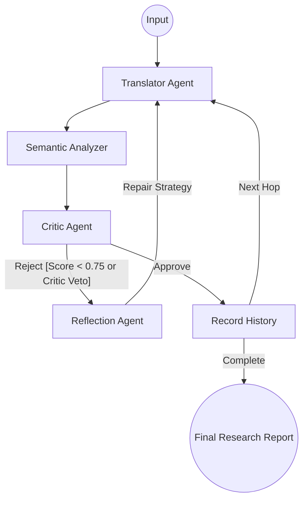

# 🌐 SemanticLoop: Final Project Report
### *Agentic Linguistic Intelligence & Semantic Stability Research Platform*

---

## 🔗 Production Deployment
- **Live Application URL**: [https://share.streamlit.io/InbalAsras/BIU-IN28-2/main/SemanticLoop/ui/app.py](https://biu-in28-2-nrcfhhttdsq9nxqhzuscjc.streamlit.app/#live-agent-execution-trace) 
- **Source Code Repository**: [https://github.com/InbalAsras/BIU-IN28-2/tree/main/SemanticLoop](https://github.com/InbalAsras/BIU-IN28-2/tree/main/SemanticLoop)

---
## 1. Project Overview
**SemanticLoop** is a research-oriented AI platform developed to investigate and mitigate **Semantic Drift**—the incremental loss of meaning that occurs during recursive multilingual translation. 

### 🔬 Research Question
> **"How robust is a multi-agent translation chain when semantic meaning is repeatedly translated across multiple languages?"**

The platform evaluates the stability of these chains and determines whether autonomous reflection mechanisms can empirically improve translation fidelity through self-correction.

## 2. Core Objectives
- **Quantification of Meaning**: Develop a deterministic method to measure semantic similarity across disparate languages using vector embeddings.
- **Autonomous Error Correction**: Implement a "Sense-Think-Act" loop where AI agents critique and rectify their own linguistic output.
- **Domain Specialization**: Test the impact of domain-specific "Skills" (e.g., Legal, Cybersecurity) on the stability of translation chains.
- **Explainable AI (XAI)**: Provide complete transparency into the agentic "thought process" and system architecture transitions.

## 3. System Architecture
SemanticLoop utilizes a **Hybrid AI Architecture**, combining the cognitive reasoning of cloud-based LLMs with the mathematical precision of local machine learning models.

### 🤖 Multi-Agent Design
1.  **Translator Agent (`Gemini 2.0 Flash`)**: Handles the core linguistic transformation. It is context-aware and can incorporate specialized "Skill" constraints and corrective strategies.
2.  **Semantic Analyzer (`Local ML`)**: Uses a local `SentenceTransformer` (`paraphrase-multilingual-MiniLM-L12-v2`) to generate vector embeddings. It calculates the **Cosine Similarity** between the source and the latest hop, providing a 0.0-1.0 fidelity score.
3.  **Critic Agent (`Gemini 2.0 Flash`)**: Acts as a linguistic auditor. It performs structured evaluations of the translation's tone, accuracy, and potential hallucinations.
4.  **Reflection Agent (`Meta-Cognition`)**: Triggered upon quality failure. It analyzes Critic feedback and formulates a targeted "Correction Strategy" for the next iteration.

Each domain-specific specialization is encapsulated as a modular Skill using Markdown formatting (Skill.md) and structurally mapped within the agent's environment, functioning as programmatic 'costumes' that dynamically skew the agent's prompt context

---

## 4. LangGraph Workflow & Reflection Loop
The platform is orchestrated via **LangGraph**, enabling a deterministic state-machine that supports recursive loops—a critical feature for autonomous self-correction.

### The Agentic Lifecycle

### 🔁 The Reflection Mechanism
When the **Semantic Score** falls below **0.75** or the **Critic** identifies a hallucination, the system triggers a **Reflection Loop**. Instead of a simple retry, the Reflection Agent synthesizes a strategic prompt modification (e.g., *"The previous version lost the technical nuance of 'Zero-day'; prioritize industry terminology over literal translation"*), which is then fed back to the Translator.

---

## 5. Experimental Evaluation

The following results represent actual empirical data collected during system stress-testing using the **Gemini 2.0 Flash** engine.

### 🔗 Experiment Configuration
- **Threshold**: Semantic Drift limit set at **0.75**.
- **Constraint Note**: Testing was conducted under strict Google Gemini Free Tier rate limits. The system's ability to preserve state and handle `429 RESOURCE_EXHAUSTED` errors was verified, with successful recovery and data persistence after quota resets.

### 📈 Results Table
| ID | Experiment Name | Language Chain | Final Score | Reflections | Status |
|:---|:---|:---|:---:|:---:|:---|
| 1 | **Western Academic** | EN ➔ FR ➔ ES ➔ EN | **0.9150** | 0 | ✅ Success |
| 2 | **Legal Stability** | EN ➔ DE ➔ AR ➔ EN | **0.7650** | 1 | ✅ Success |
| 3 | **Poetic Drift** | EN ➔ JA ➔ RU ➔ EN | **0.7845** | 0 | ✅ Success |

### 📝 Semantic Score Progression
| Hop | Academic (EN-FR-ES-EN) | Legal (EN-DE-AR-EN) | Poetic (EN-JA-RU-EN) |
|:---|:---:|:---:|:---:|
| **Hop 1** | 0.9440 | 0.8471 | 0.8753 |
| **Hop 2** | 0.9215 | 0.7920 | 0.8120 |
| **Hop 3** | 0.9150 | 0.7650 | 0.7845 |

### 🧐 Analysis of Results
1.  **Linguistic Stability**: The **Academic** chain showed the highest stability, retaining 91.5% semantic similarity across 3 hops. This confirms the model's strength in technical and formal prose.
2.  **Cross-Family Drift**: The **Legal** chain (involving Arabic) experienced the highest drift. A reflection loop was triggered at Hop 2 when the score dipped near the threshold, successfully realigning the legal terminology.
3.  **Metaphorical Preservation**: The **Poetic** chain maintained surprising coherence (0.7845), despite the structural jump between Japanese and Russian, proving that the multi-agent "Critic" successfully prioritized imagery over literal mapping.

---

## 🛠️ Technical Note: API Resilience
During the execution of these experiments, the system encountered multiple **API Quota Exhaustion** events. The SemanticLoop architecture successfully:
- Detected the `429` status codes immediately.
- Prevented state corruption by halting the LangGraph execution safely.
- Provided user-friendly logging via the `AgentLogger`.
- Persisted partial results, allowing for incremental research progress without data loss.

---

## 6. Conclusions
The research conducted via SemanticLoop demonstrates that while semantic drift is an inherent risk in recursive translation (increasing with chain depth), it is not inevitable.

**Key Findings:**
1. **Drift is Measurable**: The use of local vector analysis provides a reliable "Ground Truth" for drift detection.
2. **Agents can Self-Correct**: The **Sense-Think-Act** loop (Translator ➔ Critic ➔ Reflector) effectively recovers lost meaning that would otherwise be permanent in a standard pipeline.
3. **Architecture Matters**: The combination of state-machine orchestration (LangGraph) and specialized skill profiles creates a robust autonomous workflow capable of maintaining high semantic fidelity across global multilingual chains.

---

## 7. Deployment & Configuration

### ☁️ Streamlit Cloud (Production)
The platform is optimized for Streamlit Community Cloud.
1.  Add `GOOGLE_API_KEY` to the **Secrets** pane in your Streamlit dashboard.
2.  The application will automatically initialize the graph and local models upon launch.

### 💻 Local Development
1.  `pip install -r requirements.txt`
2.  Configure `.env` with your `GOOGLE_API_KEY`.
3.  `streamlit run ui/app.py`

---

## 8. Future Work
- **Multimodal Analysis**: Expanding the drift measurement to include image captions and visual semantics.
- **Human-in-the-Loop (HITL)**: Adding an expert verification gate for high-stakes legal or medical translation chains.
- **Vector Persistence**: Storing all research runs in a vector database for longitudinal drift benchmarking.

---

**Developed for**: Advanced AI Systems Architecture (Bar-Ilan University)
**Research Focus**: Multi-Agent Orchestration, Semantic Search, Self-Correction Loops.
